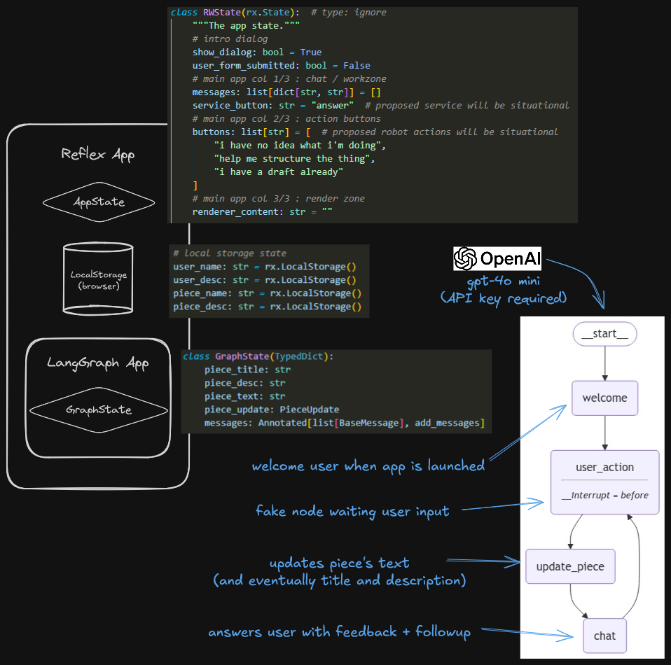

# Rincewrite

## Table of Contents
- [Rincewrite](#rincewrite)
  - [Table of Contents](#table-of-contents)
  - [Description](#description)
  - [Technologies](#technologies)
  - [Installation](#installation)
  - [Usage](#usage)
  - [Development](#development)
  - [Design](#design)
  - [Contributing](#contributing)
  - [License](#license)

## Description
**Rincewrite** is a manifesto writing assistant developed. It allows users to work interactively on writing texts through a conversational agent.

The goal of this project is to simplify the creation of manifestos and other similar documents by providing an intelligent conversational assistant to support users throughout the writing process.

## Technologies
- **Language**: Python
- **Frontend**: Reflex
- **Framework for LLM**: LangChain and LangGraph
- **Observability and Prompt Management Tool**: LangSmith
- **Dependency Management**: Poetry
- **Environment**: API keys configured in a `.env` file

## Installation
To install and configure RinceWrite locally, follow these steps:

1. Clone the repository:
    ```bash
    git clone https://github.com/BTM-ai/rincewrite.git
    cd rincewrite
    ```

2. Install the dependencies with Poetry:
    ```bash
    poetry install
    ```

3. Configure the API keys:
    - Copy the `.env.template` file to `.env`
    - Add your API keys to the `.env` file

## Usage
To run the project locally, proceed as follows:

1. Activate the Poetry environment:
    ```bash
    poetry shell
    ```

2. Run the project:
    ```bash
    reflex run
    ```

Access the user interface in your browser to start interacting with the writing assistant.

## Development
For developers wishing to contribute or work on advanced features, follow these additional steps:

1. Install the dependencies with the development tools:
    ```bash
    poetry install --with dev
    ```

2. It is recommended to use **Visual Studio Code (VSCode)** as the IDE so you can run the Reflex project directly from the editor by running the 'Reflex App - Rincewrite' configuration.

3. You can choose to display the LangGraph graph depending on the configuration:
    - If you have installed the development tools with `poetry install --with dev`, you can run the project with the graph display by running the 'Reflex App - Rincewrite with graph' configuration.
    - Otherwise, the project can be run without this option.

## Design
Below is a visual representation of the system design for **RinceWrite**:




## Contributing

Contributions are welcome! To propose changes, follow the [CONTRIBUTING.md](CONTRIBUTING.md) file.


## License
This project is licensed under the Apache 2.0 License. See the [LICENSE](LICENSE) file for details.
